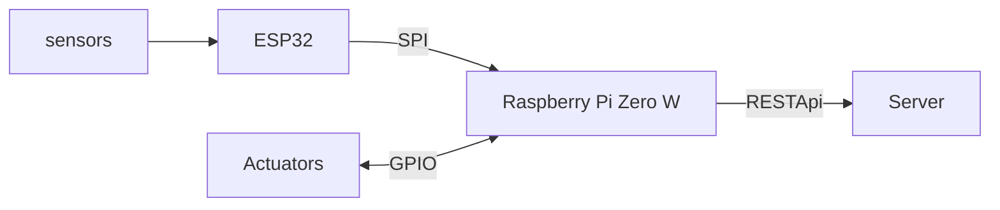

# SEMI AUTOMATIC FFS TROUBLESHOOTING SYSTEM

This project is aimed to showcase how you can automatically detect and correct common faults found in Form Fill and Seal (FFS) machines

It uses ESP32 as the sensing node and Raspberry pi zero W as the gateway. 

The web app can run either on the Raspberry pi zero W or just an independent server

### clone this repo

```bash
git clone --recursive git@github.com:RIDDDLE-EN/FFS-TROUBLESHOOTING-SYSTEM.git
```

##### Flow chart



