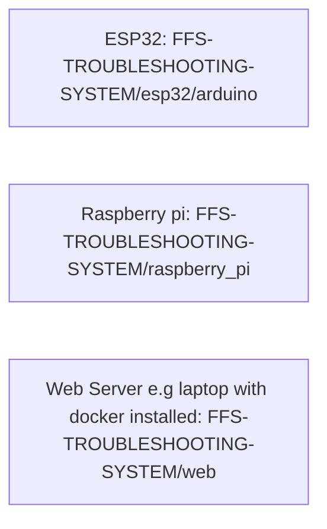
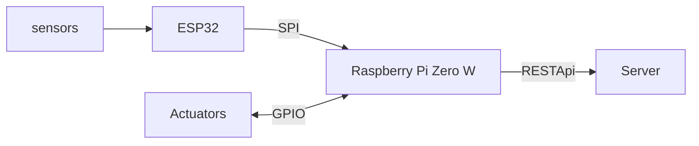

# SEMI AUTOMATIC FFS TROUBLESHOOTING SYSTEM

This project is aimed to showcase how you can automatically detect and correct common faults found in Form Fill and Seal (FFS) machines

It uses ESP32 as the sensing node and Raspberry pi zero W as the gateway. 

The web app can run either on the Raspberry pi zero W or just an independent server

##### Project structure


### clone this repo

```bash
git clone git@github.com:RIDDDLE-EN/FFS-TROUBLESHOOTING-SYSTEM.git
```

##### Flow chart



### Components needed
##### ESP32
| component | Quantity | Purpose |
|:----------|:--------:|:--------|
|ESP32 DEV| 1| sensing node |
| DHT11 | 1| Factroy's hum and temp |
| Ultrasonic sensors | 2| Roll misalignment |
| Rotary Encoders | 2| Feeding motor RPM|
| ACS712 | 2 | Feeding motor current |
| 10Kg load cell | 1 | Measure bag weight |
| HX711 | 1 | Load cell amplifier |
| LDR | 1 | Measuring bag length and counting bags |
| 650nm Laser | 1 | Accompanied with LDR |
| MPU6050 | 1 | Measuring knife snap frequency |
| K-type thermocouple | 2 | Measure sealing temp for horizontal and vertical seals|

##### Raspberry pi
| Component | Quantity | Purpose |
|:----------|:--------:|:--------| 
| Raspberry pi zero W | 1 | Control the machine operation and updating the web app |
| Stepper Motor | 1 | For roll centering |
| 12V DC Motors | 6 | 2- Feeding 2- Sealing 1- Filler 1-Roll |
| 12V DC Fan | 1 | Control the factory's temperature |
| MLX90614 | 1 | Calibrating the thermocouple |
| Heater | 1 | Heating the seals |
| 2Kg weight | 1 | Calibration of the load cell |

> There also 3D prints needed

[3D prints](https://cad.onshape.com/documents/113eaf4f55d73561e4f5e01c/w/97f87222799b850f49c9dbd6/e/748964dd8b1851b45bb074b1?renderMode=0&uiState=6a8484c2f6c37e352a41d7d2)

***remember the frame 3d is for reference on how the the system should be. It's cheaper and fucntional if made using metal pipes than 3D printed since the system will require heat***

For more information, read this article.

[Semi-Automatic FFS Troubleshooting System](https://www.linkedin.com/posts/bradley-ston-a289b9249_ugcPost-7495519398133411840-IW8o/?utm_source=social_share_send&utm_medium=member_desktop_web&rcm=ACoAAD2M-YABvbmGt5A-iuHzHl87P-tue21t15Y)

